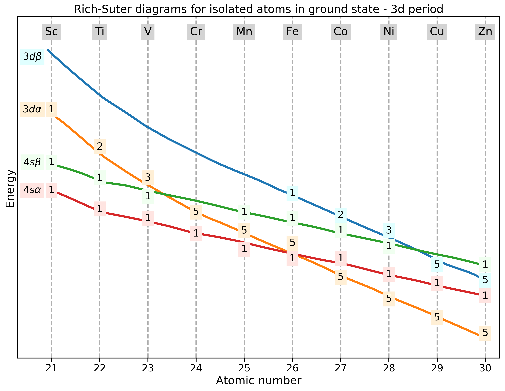

# Rich and Suter diagrams with Python



Rich and Suter diagrams are a very useful tool to explain the electron
configurations of transition elements, and in particular, the "irregular"
configurations of the elements Cr, Cu, Nb, Mo, Ru, Rh, Pd, Ag, and Pt.
They were proposed by Rich and Suter in
Rich, R. L.; Suter, R. W.; _J. Chem. Educ._ __1988__, 65, 702.
[Link](https://pubs.acs.org/doi/pdf/10.1021/ed065p702)

## Installation

Just clone or download this repo. This is not a package (yet, maybe someday :-))

## Usage

### Importing and syntax

See the [tutorial file](tutorial.ipynb).

### CLI utility

For those who work in the terminal there is a simple command line interface
(CLI) for getting the diagrams. The script name is `rich_suter.py`
and it accepts the following syntax according to its `--help`:

```
usage: Rich-Suter diagram plotter [-h] [-s] series

positional arguments:
  series      Transition series: 3d, 4d or 5d

optional arguments:
  -h, --help  show this help message and exit
  -s, --save  Saves figure in current folder
```

As seen, the series is mandatory and the `--save` flag allows to save the
diagram in the current folder. The script file must be in the same folder as
the data folder. See the following example for the 3d series diagram

```bash
$ python rich_suter.py 3d
```

If you want to save:

```bash
$ python rich_suter.py 3d --save
```

## Contributing

All contributions are welcome.

**Issues**

Feel free to submit issues regarding:

- recommendations
- more examples for the tutorial
- enhancement requests and new useful features
- code bugs

**Pull requests**

- before starting to work on your pull request, please submit an issue first
- fork the repo
- clone the project to your own machine
- commit changes to your own branch
- push your work back up to your fork
- submit a pull request so that your changes can be reviewed


## License

MIT, see [LICENSE](LICENSE)

## Citing

If you use this project in a scientific publication or in classes,
please consider citing as

F. L. S. Bustamante, *Rich and Suter diagrams with python*, 2019 -
Available at: